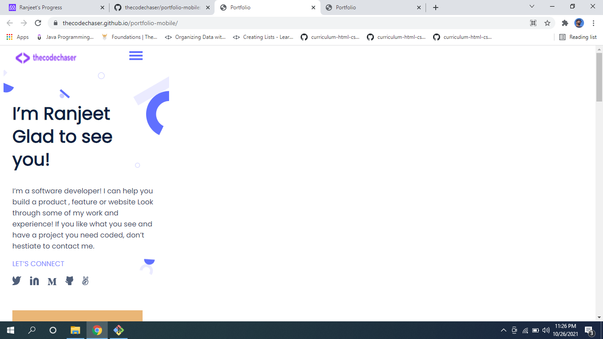
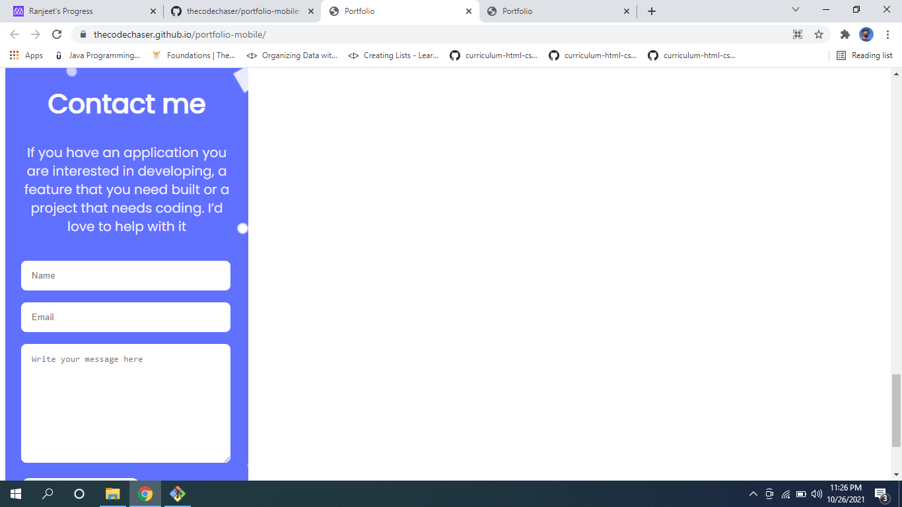

# Portfolio-Mobile

> Portfolio-mobile project is my personal portfolio for mobile devices with my details and previous project works and includes contact me form

## Screenshots

Porject's features are added into seperate branch to keep main branch safe.

## Built With

- HTML and CSS
- Markup

## Live Demo

[Live Demo Link](https://thecodechaser.github.io/portfolio-mobile/)

## Getting Started

To get a local copy up and running follow these simple example steps.

## Visit And Open Files

[Visit Repo](https://github.com/thecodechaser/portfolio-mobile)

## Download Repo

[Download Repo](https://github.com/thecodechaser/portfolio-mobile/archive/refs/heads/main.zip)

## Authors

👤 **Ranjeet Singh**

- GitHub: [@githubhandle](https://github.com/thecodechaser)
- Twitter: [@twitterhandle](https://twitter.com/thecodechaser)
- LinkedIn: [LinkedIn](https://linkedin.com/in/thecodechaser)

## 🤝 Contributing

Contributions, issues, and feature requests are welcome!

Feel free to check the [issues page](https://github.com/thecodechaser/portfolio-mobile/issues).

## Show your support

Give a ⭐️ if you like this project!

## Acknowledgments

- Inspiration: Microverse

## 📝 License

This project is [MIT](./MIT.md) licensed.
